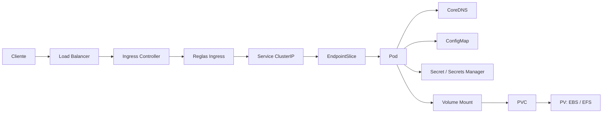

# Sesión 3: gestión de configuración y red en Kubernetes

La Sesión 3 está centrada en dos lecciones de Kubernetes:

1. **ConfigMaps y Secrets: gestión de configuración.**
2. **Modelo de red en Kubernetes: CNI, comunicación Pod-to-Pod y DNS del
   clúster.**

Estos dos temas constituyen el temario oficial de la sesión. El resto de este
documento contiene ejemplos, ideas de laboratorio y posibles extensiones que
se conservarán como referencia, pero no necesariamente se ejecutarán durante
la exposición.

> **Estado del material:** este README es un documento de trabajo. Los ejemplos
> de Ingress, volúmenes, PV/PVC, EFS y despliegue de modelos son opcionales y se
> irán seleccionando, ajustando o eliminando conforme se prepare la sesión.

## Lecciones principales

### 1. ConfigMaps y Secrets: gestión de configuración

La audiencia aprenderá:

- Cómo pasar variables de entorno directamente a un contenedor.
- Por qué conviene separar la configuración de la imagen del contenedor.
- Cómo crear e inspeccionar un ConfigMap.
- Cómo consumir un ConfigMap mediante `envFrom`, `configMapKeyRef` y volúmenes.
- Cuándo usar un ConfigMap y cuándo usar un Secret.
- Que los Secrets requieren una explicación adicional de seguridad, RBAC,
  cifrado y almacenes externos; esa parte se profundizará posteriormente.

### 2. Modelo de red en Kubernetes

La audiencia aprenderá:

- Qué responsabilidad tiene un plugin CNI.
- Cómo recibe una dirección IP cada Pod.
- Cómo se comunican dos Pods en el mismo nodo y en nodos diferentes.
- Por qué no se debe depender directamente de una IP efímera de Pod.
- Cómo un Service proporciona una identidad estable.
- Cómo EndpointSlice registra los backends disponibles.
- Cómo CoreDNS permite descubrir Services por nombre dentro del clúster.

## Resultado esperado

Al terminar la sesión, la audiencia deberá poder describir estos dos flujos:

```text
Configuración:
ConfigMap/Secret -> Pod -> variable de entorno o archivo montado

Red:
Pod cliente -> DNS del clúster -> Service -> EndpointSlice -> Pod destino
```

## Ejemplos disponibles

La siguiente tabla es un inventario del material preparado, no una agenda
obligatoria. Para una primera versión de la sesión, se recomienda ejecutar
solamente los dos primeros ejemplos.

| Prioridad | Ejemplo | Tema | Estado |
|---|---|---|---|
| Principal | 1 | Variables, ConfigMap y Secret | Parte del temario |
| Principal | 2 | Pod-to-Pod, Service y DNS | Parte del temario |
| Opcional | 3 | `emptyDir` contra PVC | Referencia para una ampliación |
| Opcional | 4 | Ingress + PVC | Referencia para una ampliación |
| Opcional | 5 | EFS y despliegue de modelos | Caso avanzado del repositorio |

## Laboratorios de gestión de configuración

Estos laboratorios pequeños cubren la primera lección de manera progresiva:

1. [`0-environment-variables/`](./0-environment-variables/README.md): valores
   directos mediante `env.value`, inspección dentro del contenedor y cambio
   mediante rollout.
2. [`configmaps/`](./configmaps/README.md): creación imperativa y declarativa,
   `envFrom`, `configMapKeyRef` y montaje como volumen.

Ambos usan imágenes ligeras multi-arquitectura y no requieren GPU, EFS ni un
servidor de modelos.

## Diagrama general de referencia

El diagrama incluye componentes que podrían utilizarse en futuras extensiones.
Para la lección principal de red, el recorrido que debe enfatizarse es
`Pod -> CoreDNS -> Service -> EndpointSlice -> Pod`. Ingress, Load Balancer y
almacenamiento son contexto opcional.



Flujo principal que se debe explicar:

1. El CNI asigna conectividad a los Pods dentro del clúster.
2. Un Pod cliente consulta a CoreDNS usando el nombre de un Service.
3. CoreDNS resuelve ese nombre a la dirección estable del Service.
4. El Service selecciona Pods mediante etiquetas.
5. EndpointSlice mantiene las direcciones de los Pods preparados.
6. El tráfico llega a uno de los Pods destino aunque sus IP cambien.

Elementos opcionales representados en el diagrama:

- Load Balancer e Ingress para tráfico que entra desde fuera del clúster.
- ConfigMap y Secret para configuración del Pod.
- Volumen, PVC y PV para persistencia de datos.

## Preparación

El repositorio está orientado a EKS. Antes de la exposición hay que verificar
el contexto para no ejecutar los ejemplos accidentalmente en otro clúster.

### Configurar y validar el contexto de EKS

Confirmar primero la identidad y cuenta de AWS que se están utilizando:

```bash
aws sts get-caller-identity
```

Crear o actualizar la entrada de kubeconfig con un alias corto y predecible:

```bash
aws eks update-kubeconfig \
  --region us-east-1 \
  --name 352-demo-dev-eks \
  --alias 352-demo-dev-eks
```

Listar los contextos y seleccionar explícitamente el de esta demostración:

```bash
kubectl config get-contexts
kubectl config use-context 352-demo-dev-eks
kubectl config current-context
```

La última salida debe ser exactamente:

```text
352-demo-dev-eks
```

Validar el acceso antes de crear, modificar o eliminar recursos:

```bash
kubectl cluster-info
kubectl get nodes \
  --output wide \
  --label-columns workload,accelerator
kubectl get pods --all-namespaces
```

> **Regla para la demostración:** ejecutar `kubectl config current-context`
> antes de cada bloque que cree o elimine recursos. Si no devuelve
> `352-demo-dev-eks`, detenerse y corregir el contexto.

Los siguientes comandos son una comprobación rápida cuando el contexto ya fue
creado:

```bash
kubectl config current-context
kubectl config get-contexts
```

Si no se desea usar el alias, AWS también puede generar el contexto con el ARN
completo mediante:

```bash
aws eks update-kubeconfig \
  --region us-east-1 \
  --name 352-demo-dev-eks
```

Comprobar los prerrequisitos de las dos lecciones principales:

```bash
kubectl get nodes -o wide
kubectl get pods -n kube-system
kubectl get service -n kube-system
```

`IngressClass`, `StorageClass` y los CSI drivers solo se necesitan si se decide
ejecutar alguno de los ejemplos opcionales:

```bash
kubectl get ingressclass
kubectl get storageclass
kubectl get csidriver
```

Crear un namespace aislado para los ejercicios:

```bash
kubectl create namespace sesion-3
```

## Demo 1: ConfigMap y Secret

Crear configuración no confidencial:

```bash
kubectl create configmap signal-config \
  --namespace sesion-3 \
  --from-literal=MODEL_PROVIDER=litellm_proxy \
  --from-literal=SIGNAL_THRESHOLD=0.70
```

Crear un secreto exclusivamente de demostración:

```bash
kubectl create secret generic signal-secret \
  --namespace sesion-3 \
  --from-literal=API_TOKEN=demo-token-only
```

Inspeccionarlos:

```bash
kubectl get configmap signal-config \
  --namespace sesion-3 \
  --output yaml

kubectl describe secret signal-secret \
  --namespace sesion-3
```

### Puntos para explicar

- Un ConfigMap contiene configuración no confidencial.
- Un Secret contiene información sensible, pero base64 no es cifrado.
- Ambos pueden consumirse como variables de ambiente o archivos montados.
- Para secretos reales se deben aplicar RBAC, cifrado en reposo y mínimo
  privilegio.
- En EKS, Secrets Store CSI Driver permite montar valores de AWS Secrets
  Manager o Parameter Store como archivos dentro del Pod.

### Caso real: ConfigMap de GPU time-slicing

El repositorio contiene un ConfigMap usado por NVIDIA Device Plugin:

```bash
kubectl apply \
  --filename examples/kubernetes/gpu-sharing/time-slicing/nvidia-device-plugin-timeslicing-config.yaml

kubectl get configmap nvidia-device-plugin-timeslicing \
  --namespace kube-system \
  --output yaml
```

Este ejemplo demuestra que el comportamiento de un componente puede cambiar
mediante configuración externa sin reconstruir su imagen. Habilitar el
time-slicing completo también requiere actualizar el release de Helm; no se
recomienda hacerlo en vivo sin haber ensayado el cambio.

### Validar Secrets Store CSI Driver

```bash
kubectl get csidriver secrets-store.csi.k8s.io
kubectl get pods --namespace kube-system | grep -E 'secrets-store|secrets-provider'
kubectl get secretproviderclass --all-namespaces
```

Arquitectura que se debe explicar:

```text
Pod -> ServiceAccount/Pod Identity -> Secrets Store CSI Driver
    -> AWS Secrets Manager -> archivo montado
```

## Demo 2: red, Service y DNS

Crear dos réplicas de una aplicación pequeña y exponerlas mediante un Service:

```bash
kubectl create deployment signal-api \
  --namespace sesion-3 \
  --image=nginx:1.27-alpine \
  --replicas=2

kubectl expose deployment signal-api \
  --namespace sesion-3 \
  --port=80 \
  --target-port=80

kubectl rollout status deployment/signal-api \
  --namespace sesion-3
```

Mostrar las capas de descubrimiento y enrutamiento:

```bash
kubectl get pods --namespace sesion-3 --output wide
kubectl get service --namespace sesion-3
kubectl get endpointslices --namespace sesion-3
```

Crear un Pod cliente:

```bash
kubectl run network-client \
  --namespace sesion-3 \
  --image=busybox:1.36 \
  --restart=Never \
  --command -- sleep 3600

kubectl wait pod/network-client \
  --namespace sesion-3 \
  --for=condition=Ready \
  --timeout=90s
```

Probar DNS y acceso mediante el Service:

```bash
kubectl exec --namespace sesion-3 network-client -- \
  nslookup signal-api

kubectl exec --namespace sesion-3 network-client -- \
  nslookup signal-api.sesion-3.svc.cluster.local

kubectl exec --namespace sesion-3 network-client -- \
  wget -qO- http://signal-api
```

### Puntos para explicar

- Cada Pod recibe una IP propia mediante el CNI.
- Las direcciones de los Pods son efímeras.
- El Service proporciona una IP y un nombre estables.
- EndpointSlice se actualiza cuando aparecen, desaparecen o dejan de estar
  preparados los Pods.
- CoreDNS resuelve `service.namespace.svc.cluster.local`.
- El dataplane del clúster dirige la conexión hacia uno de los endpoints.

## Material opcional y extensiones

A partir de este punto, el contenido no forma parte del temario obligatorio de
la Sesión 3. Se conserva para seleccionar futuras demostraciones o ampliar la
sesión si hay tiempo.

## Demo 3 (opcional): `emptyDir` contra PVC

### Parte A: `emptyDir`

Usar como referencia el manifiesto existente:

```text
examples/kubernetes/base-deployments/01-model-storage/01-emptydir-download.yaml
```

Este ejemplo descarga un modelo en `/models`, respaldado por `emptyDir`.

Idea principal:

- Los datos sobreviven al reinicio de un contenedor dentro del mismo Pod.
- Los datos desaparecen cuando el Pod es eliminado o reemplazado.
- Cada réplica mantiene su propia copia del modelo.

El ejemplo necesita una GPU y descarga un modelo. Para evitar tiempos muertos,
se recomienda mostrar el manifiesto durante la explicación y ejecutar la
descarga solamente si el Pod ya está preparado.

### Encender y apagar la GPU L40S para la demostración

El clúster mantiene el node group fijo `gpu_fixed_l40s` definido, pero con
capacidad cero para evitar gasto cuando no se utiliza. La configuración actual
usa una instancia `g6e.xlarge` On-Demand: una GPU NVIDIA L40S de 48 GiB, 4 vCPU
y 32 GiB de memoria. En `us-east-1` su precio de referencia es aproximadamente
USD 1.86 por hora; se debe consultar el precio vigente antes de la sesión.

Nombre actual del clúster y del node group:

```text
Cluster:    352-demo-dev-eks
Node group: gpu_fixed_l40s-20260806040341667300000001
```

Verificar primero que la GPU está apagada:

```bash
aws eks describe-nodegroup \
  --region us-east-1 \
  --cluster-name 352-demo-dev-eks \
  --nodegroup-name gpu_fixed_l40s-20260806040341667300000001 \
  --query 'nodegroup.{status:status,instanceTypes:instanceTypes,scaling:scalingConfig}'
```

El estado seguro antes y después de la demostración es:

```text
minSize: 0
desiredSize: 0
maxSize: 1
```

Encender exactamente un worker L40S:

```bash
aws eks update-nodegroup-config \
  --region us-east-1 \
  --cluster-name 352-demo-dev-eks \
  --nodegroup-name gpu_fixed_l40s-20260806040341667300000001 \
  --scaling-config minSize=1,maxSize=1,desiredSize=1

aws eks wait nodegroup-active \
  --region us-east-1 \
  --cluster-name 352-demo-dev-eks \
  --nodegroup-name gpu_fixed_l40s-20260806040341667300000001

kubectl get nodes \
  --label-columns workload,accelerator \
  --watch
```

Terminar `kubectl get nodes --watch` con `Ctrl+C` cuando el nuevo nodo aparezca
como `Ready`. Que el node group esté `ACTIVE` no garantiza por sí solo que el
nodo ya esté preparado para recibir Pods.

El NVIDIA Device Plugin también debe estar instalado para que Kubernetes
publique el recurso `nvidia.com/gpu`:

```bash
cd infrastructure/lv-3-cluster-services/nvidia-device-plugin
terraform init
terraform plan
terraform apply
cd ../../..

kubectl get pods --namespace kube-system | grep nvidia
kubectl describe nodes | grep -A5 'nvidia.com/gpu'
```

El manifiesto de `emptyDir` usa originalmente `workload: gpu`, mientras que el
grupo fijo L40S tiene la etiqueta `workload: gpu-fixed-hi-mem`. Para esta ruta,
el `nodeSelector` del Pod debe ser:

```yaml
nodeSelector:
  workload: gpu-fixed-hi-mem
```

Una forma de aplicarlo sin modificar el ejemplo base es sustituir el selector
al vuelo:

```bash
sed 's/workload: gpu/workload: gpu-fixed-hi-mem/' \
  examples/kubernetes/base-deployments/01-model-storage/01-emptydir-download.yaml \
  | kubectl apply --filename -

kubectl rollout status deployment/vllm-gpu-emptydir --timeout=15m
kubectl get pod --selector app=vllm-gpu-emptydir --output wide
```

Al terminar, eliminar primero el workload y luego apagar la instancia:

```bash
kubectl delete deployment vllm-gpu-emptydir --ignore-not-found

aws eks update-nodegroup-config \
  --region us-east-1 \
  --cluster-name 352-demo-dev-eks \
  --nodegroup-name gpu_fixed_l40s-20260806040341667300000001 \
  --scaling-config minSize=0,maxSize=1,desiredSize=0

aws eks wait nodegroup-active \
  --region us-east-1 \
  --cluster-name 352-demo-dev-eks \
  --nodegroup-name gpu_fixed_l40s-20260806040341667300000001

kubectl get nodes --label-columns workload,accelerator
```

Confirmar finalmente que `desiredSize` regresó a cero:

```bash
aws eks describe-nodegroup \
  --region us-east-1 \
  --cluster-name 352-demo-dev-eks \
  --nodegroup-name gpu_fixed_l40s-20260806040341667300000001 \
  --query 'nodegroup.scalingConfig'
```

> **Control de costo:** no confiar en un `terraform apply` posterior para
> apagar el worker. El módulo de EKS ignora cambios continuos de
> `desired_size` para permitir autoscaling. El comando explícito de apagado y
> la verificación de `desiredSize: 0` forman parte obligatoria de la limpieza.

### Parte B: PVC

La demostración debe montar un PVC en `/data`, escribir un archivo y reemplazar
el Pod:

```bash
kubectl get storageclass
kubectl get pvc,pv --namespace sesion-3

kubectl exec --namespace sesion-3 deploy/persistent-web -- \
  sh -c 'date >> /data/history.txt'

kubectl exec --namespace sesion-3 deploy/persistent-web -- \
  cat /data/history.txt

kubectl delete pod \
  --namespace sesion-3 \
  --selector app=persistent-web

kubectl rollout status deployment/persistent-web \
  --namespace sesion-3

kubectl exec --namespace sesion-3 deploy/persistent-web -- \
  cat /data/history.txt
```

El archivo debe continuar disponible en el Pod nuevo porque el ciclo de vida
del volumen persistente es independiente del Pod.

### Cuándo mencionar `hostPath`

`hostPath` es almacenamiento local del nodo. Se recomienda explicarlo mediante
YAML y no usarlo como la demostración principal porque:

- Acopla el Pod a un nodo concreto.
- Los datos no acompañan al Pod si cambia de nodo.
- Puede exponer archivos sensibles del host.
- Es más apropiado para agentes de nodo o laboratorios controlados.

## Demo 4 (opcional): laboratorio Ingress + PVC

Esta es la demostración principal de la sesión:

```text
Ingress
   |
Service ClusterIP
   |
Deployment nginx
   |
/usr/share/nginx/html
   |
PVC
   |
PV dinámico: EBS o EFS
```

El laboratorio debe contener:

- Un PVC creado mediante la StorageClass predeterminada.
- Un Deployment de una réplica.
- Un volumen montado en `/usr/share/nginx/html`.
- Un init container que cree `index.html` solamente si no existe.
- Un Service de tipo `ClusterIP`.
- Un Ingress que dirija `/` hacia el Service.

Validación sugerida:

```bash
kubectl get pod,service,ingress,pvc,pv \
  --namespace sesion-3

kubectl describe ingress persistent-web \
  --namespace sesion-3

kubectl get ingress persistent-web \
  --namespace sesion-3
```

Escribir contenido, reemplazar el Pod y volver a consultar el Ingress:

```bash
kubectl exec --namespace sesion-3 deploy/persistent-web -- \
  sh -c 'echo "Signal generated at $(date)" >> /usr/share/nginx/html/index.html'

kubectl delete pod \
  --namespace sesion-3 \
  --selector app=persistent-web

kubectl rollout status deployment/persistent-web \
  --namespace sesion-3

curl http://INGRESS_ADDRESS/
```

El mensaje debe continuar disponible después de reemplazar el Pod.

### IngressClass

No se debe asumir la clase instalada:

```bash
kubectl get ingressclass
```

Ejemplos comunes:

```yaml
spec:
  ingressClassName: nginx
```

Con AWS Load Balancer Controller:

```yaml
spec:
  ingressClassName: alb
```

Un objeto Ingress sin un Ingress Controller no recibe tráfico por sí solo.

## Demo 5 (opcional): persistencia de modelos sobre EFS

Usar el ejemplo avanzado existente:

```text
examples/kubernetes/base-deployments/01-model-storage/02-pv-efs.yaml
```

Validar primero la infraestructura:

```bash
kubectl get storageclass efs-sc
kubectl get pods \
  --namespace kube-system \
  --selector app.kubernetes.io/name=aws-efs-csi-driver
```

Aplicar el ejemplo:

```bash
kubectl apply \
  --filename examples/kubernetes/base-deployments/01-model-storage/02-pv-efs.yaml \
  --namespace demo-examples

kubectl get pvc,pv --namespace demo-examples
kubectl logs \
  --namespace demo-examples \
  deployment/vllm-gpu-pv \
  --container model-downloader
```

Recrear el workload:

```bash
kubectl scale deployment/vllm-gpu-pv \
  --replicas=0 \
  --namespace demo-examples

kubectl scale deployment/vllm-gpu-pv \
  --replicas=1 \
  --namespace demo-examples
```

La primera ejecución descarga el modelo en EFS. En la siguiente ejecución, el
init container encuentra el modelo en el PVC y omite la descarga.

## Plan de contingencia

Antes de la exposición conviene guardar las salidas de los siguientes comandos:

```bash
kubectl get nodes -o wide
kubectl get ingressclass
kubectl get storageclass
kubectl get pods,service,ingress,pvc,pv --all-namespaces
```

Si el Load Balancer tarda en obtener una dirección, se puede validar la
aplicación mediante port-forward:

```bash
kubectl port-forward \
  --namespace sesion-3 \
  service/persistent-web \
  8080:80
```

En otra terminal:

```bash
curl http://127.0.0.1:8080/
```

Para evitar retrasos durante la sesión:

- Descargar previamente las imágenes de contenedor.
- Crear previamente el Load Balancer del Ingress.
- Confirmar que la StorageClass puede aprovisionar volúmenes.
- Mantener la demostración pequeña como principal.
- Usar EFS, GPU time-slicing y Secrets Store CSI como casos avanzados.

## Limpieza

Eliminar solamente los recursos creados por esta sesión:

```bash
kubectl delete namespace sesion-3
```

Los ejemplos desplegados en `demo-examples` y la configuración de
time-slicing se deben limpiar por separado siguiendo sus respectivos README.

## Referencias

- [ConfigMaps](https://kubernetes.io/docs/concepts/configuration/configmap/)
- [Secrets](https://kubernetes.io/docs/concepts/configuration/secret/)
- [Modelo de red de Kubernetes](https://kubernetes.io/docs/concepts/services-networking/)
- [DNS para Services y Pods](https://kubernetes.io/docs/concepts/services-networking/dns-pod-service/)
- [Ingress](https://kubernetes.io/docs/concepts/services-networking/ingress/)
- [Volumes](https://kubernetes.io/docs/concepts/storage/volumes/)
- [Secrets Store CSI Driver en EKS](https://docs.aws.amazon.com/eks/latest/userguide/manage-secrets.html)
- [Almacenamiento de modelos](../base-deployments/01-model-storage/README.md)
- [GPU time-slicing](../gpu-sharing/time-slicing/README.md)
