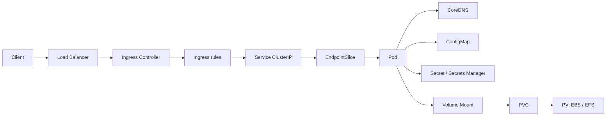

# Session 3: configuration, storage and networking in Kubernetes

Session 3 is built around two core Kubernetes lessons:

1. **ConfigMaps and Secrets: configuration management.**
2. **The Kubernetes networking model: CNI, Pod-to-Pod communication and cluster
   DNS.**

Storage grew into a full third lab and can be taught as part of the session or
left out, depending on available time.

## Core lessons

### 1. ConfigMaps and Secrets

The audience will learn:

- How to pass environment variables directly to a container.
- Why configuration should be separated from the container image.
- How to create and inspect a ConfigMap.
- How to consume a ConfigMap through `envFrom`, `configMapKeyRef` and volumes.
- When to use a ConfigMap and when to use a Secret.
- That Secrets need an additional conversation about security, RBAC, encryption
  and external stores; that part is covered later.

### 2. The Kubernetes networking model

The audience will learn:

- What a CNI plugin is responsible for.
- How each Pod receives an IP address.
- How two Pods communicate on the same node and across nodes.
- Why an ephemeral Pod IP must never be depended on.
- How a Service provides a stable identity.
- How an EndpointSlice records the available backends.
- How CoreDNS makes Services discoverable by name inside the cluster.

### 3. Storage (optional, self-contained)

The audience will learn:

- Whose lifecycle a volume follows: the Pod, the node, or nobody.
- Why Kubernetes cannot create a disk on its own, and what CSI is.
- How a StorageClass, a PVC and a PV relate to each other.
- The binding rules and the reclaim policies.
- The difference between `ReadWriteOnce` and `ReadWriteMany`, using a real model
  served from a GPU node while an ARM node reads the same volume.

## Expected outcome

By the end of the session, the audience should be able to describe these flows:

```text
Configuration:
ConfigMap/Secret -> Pod -> environment variable or mounted file

Networking:
Client Pod -> cluster DNS -> Service -> EndpointSlice -> target Pod

Storage:
Pod -> PVC -> StorageClass -> CSI driver -> PV -> cloud volume
```

## Labs

Each lab is progressive and has its own README:

1. [`0-environment-variables/`](./0-environment-variables/README.md): direct
   values through `env.value`, inspection inside the container, and change via
   rollout.
2. [`1-configmaps/`](./1-configmaps/README.md): imperative and declarative
   creation, `envFrom`, `configMapKeyRef`, and mounting as a volume.
3. [`2-secrets/`](./2-secrets/README.md): imperative and declarative creation of
   an example Secret.
4. [`3-storage/`](./3-storage/README.md): `emptyDir`, `hostPath`, CSI,
   StorageClass, PV/PVC, reclaim policies, and shared storage on EFS serving a
   model from a GPU node and an ARM node at the same time.
5. [`4-networking/`](./4-networking/README.md): CNI, Pod-to-Pod communication,
   Services, EndpointSlices, cluster DNS and optional Ingress.

The environment variables, Secrets and early ConfigMap steps use lightweight
multi-architecture images. The last ConfigMap step deploys vLLM and does require
the GPU worker.

The storage lab requires installing two CSI drivers: the `aws-ebs-csi-driver`
add-on (steps 3 to 6) and the EFS Terraform stack in
`infrastructure/lv-3-cluster-services/efs` (steps 7 to 9). Both procedures are
documented inside [`3-storage/README.md`](./3-storage/README.md).

## Reference diagram

For the networking lesson, the path to emphasise is
`Pod -> CoreDNS -> Service -> EndpointSlice -> Pod`. Ingress, the Load Balancer
and storage are optional context.



Main flow to explain:

1. The CNI gives Pods connectivity inside the cluster.
2. A client Pod queries CoreDNS using a Service name.
3. CoreDNS resolves that name to the Service's stable address.
4. The Service selects Pods by label.
5. The EndpointSlice holds the addresses of the ready Pods.
6. Traffic reaches one of the target Pods even as their IPs change.

## Preparation

The repository targets EKS. Verify the context before the session so the
examples never run against another cluster by accident.

### Configure and validate the EKS context

Confirm the AWS identity and account in use:

```bash
aws sts get-caller-identity
```

Create or update the kubeconfig entry with a short, predictable alias:

```bash
aws eks update-kubeconfig \
  --region us-east-1 \
  --name 352-demo-dev-eks \
  --alias 352-demo-dev-eks
```

List the contexts and select this demo's context explicitly:

```bash
kubectl config get-contexts
kubectl config use-context 352-demo-dev-eks
kubectl config current-context
```

The last output must be exactly:

```text
352-demo-dev-eks
```

Validate access before creating, modifying or deleting resources:

```bash
kubectl cluster-info
kubectl get nodes \
  --output wide \
  --label-columns workload,accelerator
kubectl get pods --all-namespaces
```

> **Rule for the demo:** run `kubectl config current-context` before every block
> that creates or deletes resources. If it does not return `352-demo-dev-eks`,
> stop and fix the context.

Check the prerequisites of the core lessons:

```bash
kubectl get nodes -o wide
kubectl get pods -n kube-system
kubectl get service -n kube-system
```

`IngressClass`, `StorageClass` and the CSI drivers are only needed for the
storage and Ingress labs:

```bash
kubectl get ingressclass
kubectl get storageclass
kubectl get csidriver
```

Create an isolated namespace for the exercises:

```bash
kubectl apply --filename examples/kubernetes/session-3/00-namespace.yaml
```

## Quick demo: ConfigMap and Secret

Create non-confidential configuration:

```bash
kubectl create configmap signal-config \
  --namespace session-3 \
  --from-literal=MODEL_PROVIDER=litellm_proxy \
  --from-literal=SIGNAL_THRESHOLD=0.70
```

Create a demo-only secret:

```bash
kubectl create secret generic signal-secret \
  --namespace session-3 \
  --from-literal=API_TOKEN=demo-token-only
```

Inspect them:

```bash
kubectl get configmap signal-config \
  --namespace session-3 \
  --output yaml

kubectl describe secret signal-secret \
  --namespace session-3
```

### Points to explain

- A ConfigMap holds non-confidential configuration.
- A Secret holds sensitive data, but base64 is encoding, not encryption.
- Both can be consumed as environment variables or mounted files.
- Real secrets need RBAC, encryption at rest and least privilege.
- On EKS, the Secrets Store CSI Driver can mount values from AWS Secrets Manager
  or Parameter Store as files inside the Pod.

### Real case: the GPU time-slicing ConfigMap

The repository contains a ConfigMap consumed by the NVIDIA Device Plugin:

```bash
kubectl apply \
  --filename examples/kubernetes/gpu-sharing/time-slicing/nvidia-device-plugin-timeslicing-config.yaml

kubectl get configmap nvidia-device-plugin-timeslicing \
  --namespace kube-system \
  --output yaml
```

This shows that a component's behaviour can change through external
configuration without rebuilding its image. Enabling full time-slicing also
requires updating the Helm release; do not attempt that live without rehearsing.

### Validate the Secrets Store CSI Driver

```bash
kubectl get csidriver secrets-store.csi.k8s.io
kubectl get pods --namespace kube-system | grep -E 'secrets-store|secrets-provider'
kubectl get secretproviderclass --all-namespaces
```

Architecture to explain:

```text
Pod -> ServiceAccount/Pod Identity -> Secrets Store CSI Driver
    -> AWS Secrets Manager -> mounted file
```

## Quick demo: networking, Service and DNS

Create two replicas of a small application and expose them through a Service:

```bash
kubectl create deployment signal-api \
  --namespace session-3 \
  --image=nginx:1.27-alpine \
  --replicas=2

kubectl expose deployment signal-api \
  --namespace session-3 \
  --port=80 \
  --target-port=80

kubectl rollout status deployment/signal-api \
  --namespace session-3
```

Show the discovery and routing layers:

```bash
kubectl get pods --namespace session-3 --output wide
kubectl get service --namespace session-3
kubectl get endpointslices --namespace session-3
```

Create a client Pod:

```bash
kubectl run network-client \
  --namespace session-3 \
  --image=busybox:1.36 \
  --restart=Never \
  --command -- sleep 3600

kubectl wait pod/network-client \
  --namespace session-3 \
  --for=condition=Ready \
  --timeout=90s
```

Test DNS and access through the Service:

```bash
kubectl exec --namespace session-3 network-client -- \
  nslookup signal-api

kubectl exec --namespace session-3 network-client -- \
  nslookup signal-api.session-3.svc.cluster.local

kubectl exec --namespace session-3 network-client -- \
  wget -qO- http://signal-api
```

### Points to explain

- Every Pod receives its own IP through the CNI.
- Pod addresses are ephemeral.
- The Service provides a stable IP and name.
- The EndpointSlice updates as Pods appear, disappear or stop being ready.
- CoreDNS resolves `service.namespace.svc.cluster.local`.
- The cluster data plane directs the connection to one of the endpoints.

For the full networking lab, including Pod-to-Pod calls and the optional Ingress,
see [`4-networking/`](./4-networking/README.md).

## Turning the L40S GPU on and off

The cluster keeps the fixed `gpu_fixed_l40s` node group defined but scaled to
zero, to avoid spending when it is not in use. It uses an On-Demand
`g6e.xlarge`: one 48 GiB NVIDIA L40S, 4 vCPU and 32 GiB of memory. In
`us-east-1` the reference price is roughly USD 1.86 per hour; check the current
price before the session.

Current cluster and node group names:

```text
Cluster:    352-demo-dev-eks
Node group: gpu_fixed_l40s-20260806040341667300000001
```

Check the GPU is off:

```bash
aws eks describe-nodegroup \
  --region us-east-1 \
  --cluster-name 352-demo-dev-eks \
  --nodegroup-name gpu_fixed_l40s-20260806040341667300000001 \
  --query 'nodegroup.{status:status,instanceTypes:instanceTypes,scaling:scalingConfig}'
```

The safe state before and after the demo is:

```text
minSize: 0
desiredSize: 0
maxSize: 1
```

Start exactly one L40S worker:

```bash
aws eks update-nodegroup-config \
  --region us-east-1 \
  --cluster-name 352-demo-dev-eks \
  --nodegroup-name gpu_fixed_l40s-20260806040341667300000001 \
  --scaling-config minSize=1,maxSize=1,desiredSize=1

aws eks wait nodegroup-active \
  --region us-east-1 \
  --cluster-name 352-demo-dev-eks \
  --nodegroup-name gpu_fixed_l40s-20260806040341667300000001

kubectl get nodes \
  --label-columns workload,accelerator \
  --watch
```

Stop the watch with `Ctrl+C` once the new node shows as `Ready`. A node group
reaching `ACTIVE` does not by itself guarantee the node can accept Pods.

The NVIDIA Device Plugin must also be installed for Kubernetes to advertise the
`nvidia.com/gpu` resource:

```bash
cd infrastructure/lv-3-cluster-services/nvidia-device-plugin
terraform init
terraform plan
terraform apply
cd ../../..

kubectl get pods --namespace kube-system | grep nvidia
kubectl describe nodes | grep -A5 'nvidia.com/gpu'
```

When finished, delete the workload first and then shut the instance down:

```bash
kubectl delete deployment vllm-gpu-emptydir --ignore-not-found

aws eks update-nodegroup-config \
  --region us-east-1 \
  --cluster-name 352-demo-dev-eks \
  --nodegroup-name gpu_fixed_l40s-20260806040341667300000001 \
  --scaling-config minSize=0,maxSize=1,desiredSize=0

aws eks wait nodegroup-active \
  --region us-east-1 \
  --cluster-name 352-demo-dev-eks \
  --nodegroup-name gpu_fixed_l40s-20260806040341667300000001

kubectl get nodes --label-columns workload,accelerator
```

Finally confirm `desiredSize` went back to zero:

```bash
aws eks describe-nodegroup \
  --region us-east-1 \
  --cluster-name 352-demo-dev-eks \
  --nodegroup-name gpu_fixed_l40s-20260806040341667300000001 \
  --query 'nodegroup.scalingConfig'
```

> **Cost control:** do not rely on a later `terraform apply` to switch the worker
> off. The EKS module ignores ongoing changes to `desired_size` to allow
> autoscaling. The explicit shutdown command and verifying `desiredSize: 0` are a
> mandatory part of cleanup.

## Related material in the repository

- Model storage strategies:
  [`base-deployments/01-model-storage/`](../base-deployments/01-model-storage/README.md)
- GPU time-slicing: [`gpu-sharing/time-slicing/`](../gpu-sharing/time-slicing/README.md)

## Contingency plan

Before the session, capture the output of these commands:

```bash
kubectl get nodes -o wide
kubectl get ingressclass
kubectl get storageclass
kubectl get pods,service,ingress,pvc,pv --all-namespaces
```

If a Load Balancer is slow to get an address, validate the application through
port-forward instead:

```bash
kubectl port-forward \
  --namespace session-3 \
  service/signal-api \
  8080:80
```

To avoid delays during the session:

- Pull the container images in advance.
- Create the Ingress Load Balancer in advance.
- Confirm the StorageClass can provision volumes.
- Keep the main demonstration small.
- Treat EFS, GPU time-slicing and Secrets Store CSI as advanced cases.

## Cleanup

Delete only the resources created by this session:

```bash
kubectl delete namespace session-3
```

Resources deployed in `demo-examples` and the time-slicing configuration must be
cleaned up separately, following their own READMEs.

## References

- [ConfigMaps](https://kubernetes.io/docs/concepts/configuration/configmap/)
- [Secrets](https://kubernetes.io/docs/concepts/secret/)
- [Kubernetes networking model](https://kubernetes.io/docs/concepts/services-networking/)
- [DNS for Services and Pods](https://kubernetes.io/docs/concepts/services-networking/dns-pod-service/)
- [Ingress](https://kubernetes.io/docs/concepts/services-networking/ingress/)
- [Volumes](https://kubernetes.io/docs/concepts/storage/volumes/)
- [Secrets Store CSI Driver on EKS](https://docs.aws.amazon.com/eks/latest/userguide/manage-secrets.html)
